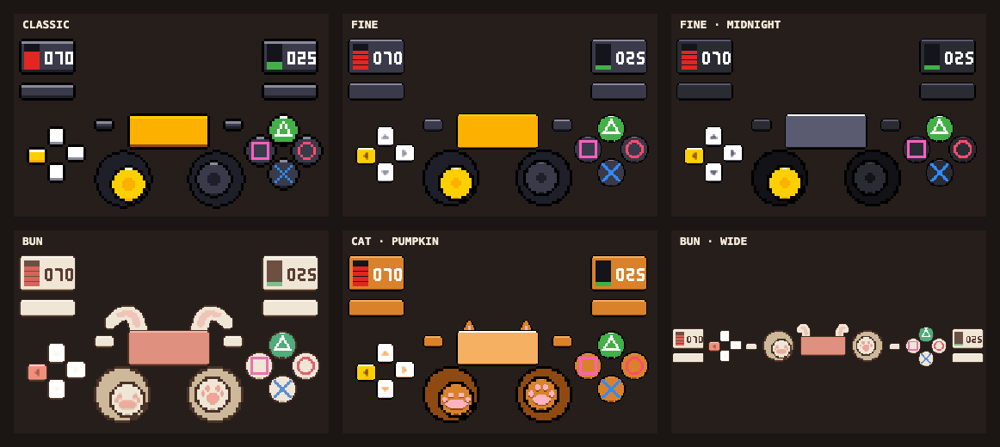
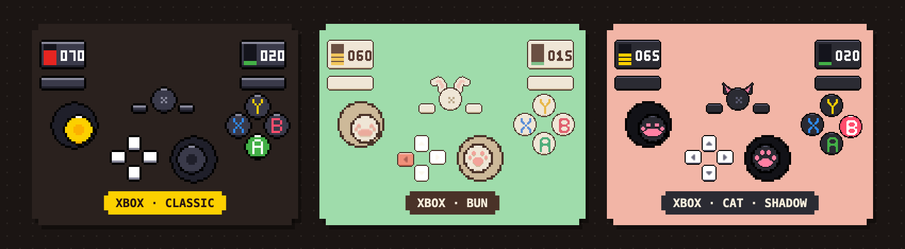

# PawPad

**Show your controller on stream, but cute.**

PawPad puts your controller on your stream as pixel-art buttons. Buttons light up when you press them, the sticks move, and L2/R2 show how far you're pulling them.



- **Pick a look:** Classic, Bun (a bunny with floppy ears), or Cat (five cat colors to choose from).
- **Xbox look too:** it works with Xbox-style controllers.
- **Play on PS4 or on your computer:** use a PS4 with a small plugin, or just plug a controller into your computer.

**Setup guide:** download `docs/guide.html` and open it in your browser. It shows the four steps below in PawPad's pixel style.



## What you need

- **Either** a PS4 with the **GoldHEN** mod (version 2.2 or newer) **or** a controller plugged into your computer.
- A computer (Mac, Windows or Linux) on the **same Wi-Fi or network** as the PS4.
- **OBS Studio**, the free app you stream with.

## Quick start

1. **Put the plugin on your PS4** (only needed if you play on the PS4). See [Step 1](#step-1-add-the-plugin-to-your-ps4).
2. **Open PawPad on your computer.** See [Step 2](#step-2-open-pawpad-on-your-computer).
3. **Add it to OBS.** See [Step 3](#step-3-add-it-to-obs).
4. **Pick your look.** See [Step 4](#step-4-pick-your-look).

Want to try it without a PS4? Turn on **Test mode** (see below).

---

## Step 1: Add the plugin to your PS4

You need a PS4 with **GoldHEN** installed. You'll copy a few files to the PS4 with an FTP app (for example FileZilla). Use port **2121** to connect.

1. Copy **`pad_stream.prx`** to the PS4 folder `/data/GoldHEN/plugins/`.
2. Copy **`pad_stream.ini`** to `/data/GoldHEN/`, then open it and set **`ip`** to your computer's address. PawPad shows this address when you open it in Step 2.
3. Open `/data/GoldHEN/plugins.ini` and add these lines (keep anything already in there):

   ```ini
   [default]
   /data/GoldHEN/plugins/pad_stream.prx
   ```

4. Restart the game, or the PS4, so GoldHEN loads the plugin.

Only want it in certain games? Put the line under that game's title ID (for example `[CUSA12085]`) instead of `[default]`.

## Step 2: Open PawPad on your computer

Download the zip for your computer from the **Releases** page and unzip it. Keep the `native` folder **next to** the PawPad program.

| Your computer | Open this | First time |
|---|---|---|
| Windows | `bridge.exe` | Allow it through the firewall when asked |
| Mac | `bridge` | Right-click it, then choose **Open**. Allow incoming connections if asked |
| Linux | `bridge` | Run `chmod +x bridge` once if it won't open |

A window opens and shows the **address** for `pad_stream.ini` and the **OBS link**. Keep it open while you stream.

If it says `waiting for packets...`, the PS4 isn't sending yet. See [Troubleshooting](#troubleshooting).

## Step 3: Add it to OBS

1. In OBS, click **+** under **Sources** and choose **Browser**.
2. Set these:

   | Setting | Value |
   |---|---|
   | URL | `http://localhost:8080/?hideUI=1` |
   | Width | `488` |
   | Height | `280` |
   | FPS | `60` |

3. Leave **Custom CSS** as it is, then resize the source on your scene however you like.

Changed something in PawPad later? Right-click the source in OBS and choose **Refresh cache of current page**.

## Step 4: Pick your look

In a web browser, go to **http://localhost:8080/** and open **Settings**. Your choices show up in OBS right away, so you never need to change the link.

| Setting | What it does |
|---|---|
| **Controller** | **Auto** picks the right controller for what you plug in. You can also choose **PlayStation** or **Xbox** |
| **Style** | **Classic** (chunky pixels, the default). **Fine** (smoother and sharper). **Bun** (a cute bunny with ears that bounce when you press the touchpad). **Cat** (cat ears and paw-print sticks) |
| **Colors** | For Fine: **Default**, or **Midnight** (dark) |
| **Which cat** | For Cat: Pumpkin, Shadow, Snowball, Smokey or Mittens |
| **Layout** | **Normal**, or **Wide** (one short row, handy when a game's HUD is in the way) |
| **Touchpad** | Show or hide the touchpad (or the Guide button on the Xbox look) |
| **Shadow** | A soft shadow behind the controller so it stands out on a busy game screen. Drag the slider to make it stronger; **Off** is the default |
| **Frame rate** | How often the overlay redraws, 5 to 60 fps. Lower it to use less CPU, or for a choppy, stylised look. 60 is the default |
| **Source** | **Auto** (the PS4 when it's sending, otherwise your computer's controller), **PS4**, or **This computer** |

The overlay stays **488 × 280** in every layout, so you never need to resize it.

### Overlay running behind your video?

If the buttons show up before the game does on your stream, raise **Capture delay** in Settings. You can also add `&delay=120` to the OBS link (the number is milliseconds, 0 to 500).

---

## Use a controller plugged into your computer

No PS4? Plug in a controller and you're set.

1. Keep the `native` folder next to PawPad (it came in the zip).
2. Plug in or pair your controller, then open PawPad. It says `Controller connected: <name>`, and the Settings page shows the same.
3. Done. **Source: Auto** uses the PS4 when it's sending and your computer's controller the rest of the time.

Good to know:
- Works with PlayStation, Xbox and Switch Pro controllers, by USB or Bluetooth.
- The **touchpad can't be read** from a controller on your computer. The PS / Xbox / Guide button takes its place, so it still lights up and makes the Bun ears bounce.
- Only the first controller is used for now (no multiple players yet).
- The Xbox look has only been tested in Test mode. Windows and Linux are untested.
- On a Mac, your browser may block the download. If so, open Terminal and run `xattr -dr com.apple.quarantine <the PawPad folder>` once.

## Test mode (no PS4 needed)

Go to **http://localhost:8080/**, open **Settings**, and turn on **Test mode**. A fake controller shows on every page, **including OBS**, so you can place and size the overlay. Turn it off when you're done.

## Troubleshooting

The badge at the top of the Settings page tells you what's wrong:

| Badge | What it means | What to do |
|---|---|---|
| **Bridge offline** | The page can't reach PawPad | Open PawPad, then check the link |
| **Waiting for PS4** | PawPad is open but the PS4 isn't sending | See below |
| **PS4 live** | All good | Nothing |
| **Controller: <name>** | Showing a controller plugged into this computer | Nothing |

**Still waiting for the PS4?**
- The `ip` in `pad_stream.ini` must be your computer's **current** address. It can change, so check the address PawPad shows.
- The PS4 and your computer must be on the **same network**. Guest Wi-Fi often blocks this.
- Let PawPad through your firewall for **UDP port 9999**.
- Restart the game after you change any plugin file.
- Try **Test mode** first. If it works there, PawPad and OBS are fine and the problem is on the PS4 side.

**"Port already in use":** PawPad is already open somewhere. Close the other copy.

**OBS shows nothing:** open PawPad before you add the source, then right-click the source and choose **Refresh cache of current page**.

---

## For developers

Everything above is for players. If you want to build or change PawPad, see the notes below.

<details>
<summary>Build and test commands</summary>

```bash
# run the bridge (Node 22+)
cd mac-receiver && npm install && npm start

# tests
npm test --prefix mac-receiver
node mac-receiver/test/verify.js   # stop any running bridge first (ports 8080/9999)

# release zips for Mac, Windows and Linux (output in dist/)
bash scripts/build-release.sh

# PS4 plugin (needs the OpenOrbis toolchain)
bash ps4-plugin/build_prx.sh

# optional macOS menu-bar launcher
bash mac-app/build.sh
```

Project layout:

```
ps4-plugin/     GoldHEN plugin (C, OpenOrbis)
mac-receiver/   the bridge: receives PS4 data, serves the overlay
obs-overlay/    the overlay page and settings
mac-app/        optional macOS menu-bar launcher
config/         example PS4 config files
scripts/        release build
```

Bridge options (advanced):

| Option | Default | Notes |
|---|---|---|
| `--http-port` | `8080` | Overlay page and settings |
| `--udp-port` | `9999` | Where the PS4 sends |
| `--ps4-ip` | any | Only accept data from this address |
| `--host` | `127.0.0.1` | Use `0.0.0.0` only if OBS runs on a different computer |
| `--no-local` | off | Ignore controllers plugged into this computer |

Security: the overlay is only reachable from this computer. UDP has no login, so use `--ps4-ip` for a hard lock on your PS4, and never expose the UDP port to the internet.

</details>

---

## License

MIT, see [LICENSE](LICENSE).

## Disclaimer

Running homebrew plugins requires a jailbroken console. You do this at your own risk, and online play with a modified console can get you banned. This project is not affiliated with Sony.
